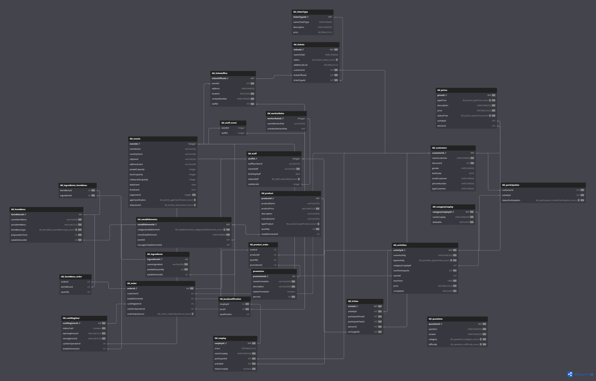
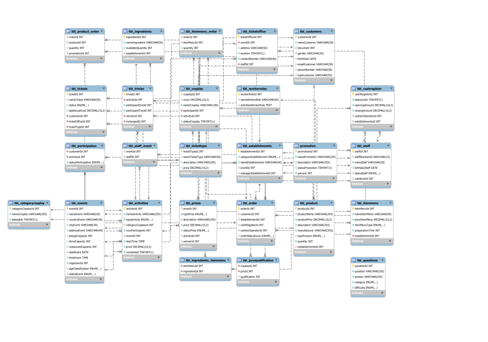

# Documentation Database

## Description

The database `db_huansync` is a fundamental component of our information system, designed to store, manage, and retrieve data efficiently. Its robust structure and optimized architecture ensure the integrity and availability of critical information for our operations.

### Main Features:

#### Purpose:
The database was created for the purpose of administering and managing multiple tasks of an Anime and Cosplay event company. This includes managing events, ticket offices, clients, participants in cosplay activities, and managing orders from establishments and stores.

#### Structure:
The database follows an Entity Relationship model, with clearly defined tables and relationships established between them. The structure has been designed to optimize efficiency in inserting, updating and querying data.

#### Access and Security:
Robust security measures have been implemented to ensure authorized access to the database. Permissions and roles have been carefully configured to protect the confidentiality and integrity of data.

#### Used technology:
The database uses technologies such as **Mysql** to ensure optimal performance and compatibility with our applications and systems.

#### Additional Documentation:
For a more detailed understanding of the database structure, schemas, stored procedures, and other elements, see the accompanying documentation.

#### How to Use the Documentation:

##### **Index**:
The documentation is logically organized with a detailed index to make it easy to find specific information.

##### **Examples and Scenarios**:
Practical examples and common usage scenarios are included to help users better understand how to interact with the database in different situations.

##### **Updates and Changes**:
The documentation is kept up to date with the latest modifications to the database structure. Significant changes are clearly highlighted to make it easier for users to adapt.


## How to create the database
To create a database in mysql, first check if you have mysql, if not you can follow this link [here](https://www.adslzone.net/esenciales/windows-10/instalar-mysql/) to install it.

For Linux users [here](https://www.digitalocean.com/community/tutorials/how-to-install-mysql-on-ubuntu-20-04-es).

The next thing is to start the service and run the following commands:

### 1. Creation of the database.

```sql
    CREATE DATABASE IF NOT EXISTS db_huansync;
    USE db_huansync;
```

### 2. Creation of tables.
To create the tables, use the file in the 'sql/database.sql' folder, copy the tables and run them using the database with the command in a mysql terminal or using the workbench interface `USE db_huansync;`
```sql
    CREATE TABLE `tbl_events` (
  `eventId` integer PRIMARY KEY AUTO_INCREMENT,
  `nameEvent` varchar(50) UNIQUE,
  ...... -- more fields
);
.... -- more tables
```

### 3. Creating relationships between tables.
We do the same with the relationships, this is done so that the errors do not escalate and the database is left in half.

```sql
ALTER TABLE `tbl_ticketoffice` ADD FOREIGN KEY (`eventId`) REFERENCES `tbl_events` (`eventId`);
... -- more relationships
```

## Diagram:

## Mysql Diagram:

## Data Dictionary

<!DOCTYPE html>
<html>
<head>
    <meta charset="UTF-8" />
    <meta name="author" content="WB DataDic" />
    <meta name="description" content="db_huansync Data Dictionary." />
    <title>db_huansync Data Dictionary</title>
    <style type="text/css">
    table{
        width: 100%;
        margin-bottom: 30px;
    }
    abbr{
        cursor: help;
    }
    table, td, th{
        border-style: solid;
        border-width: 1px;
    }
    table caption{
        font-size: 120%;
        font-weight: bold;
    }
    caption{
        color: black;
    }
    td, th{
        border-color: silver;
    }
    tr:hover{
        color: #333;
        background-color: #F2F2F2;
    }
    th{
        background-color: black;
    }
    td{
        color: black;
    }
    ul{
        font-style: italic;
    }
    #title-sect{
        color: gray;
        text-align: right;
    }
    .proj-desc{
        text-align: right;
    }
    </style>
</head>
<body>
<div id="title-sect">
<h1>db_huansync<br> Data Dictionay</h1>
<p>
<em>2024-01-25</em>
</p>
<p class="proj-desc">
<em></em>
</p>
</div>
<h2>Alphabetic Index</h2>
<ul>
<li><a href='#promotion'>promotion</a></li>
<li><a href='#tbl_activities'>tbl_activities</a></li>
<li><a href='#tbl_cashregister'>tbl_cashregister</a></li>
<li><a href='#tbl_categorycosplay'>tbl_categorycosplay</a></li>
<li><a href='#tbl_cosplay'>tbl_cosplay</a></li>
<li><a href='#tbl_customers'>tbl_customers</a></li>
<li><a href='#tbl_establishments'>tbl_establishments</a></li>
<li><a href='#tbl_events'>tbl_events</a></li>
<li><a href='#tbl_ingredients'>tbl_ingredients</a></li>
<li><a href='#tbl_ingredients_itemmenu'>tbl_ingredients_itemmenu</a></li>
<li><a href='#tbl_itemmenu'>tbl_itemmenu</a></li>
<li><a href='#tbl_itemmenu_order'>tbl_itemmenu_order</a></li>
<li><a href='#tbl_juryqualification'>tbl_juryqualification</a></li>
<li><a href='#tbl_order'>tbl_order</a></li>
<li><a href='#tbl_participation'>tbl_participation</a></li>
<li><a href='#tbl_prizes'>tbl_prizes</a></li>
<li><a href='#tbl_product'>tbl_product</a></li>
<li><a href='#tbl_product_order'>tbl_product_order</a></li>
<li><a href='#tbl_questions'>tbl_questions</a></li>
<li><a href='#tbl_staff'>tbl_staff</a></li>
<li><a href='#tbl_staff_event'>tbl_staff_event</a></li>
<li><a href='#tbl_ticketoffice'>tbl_ticketoffice</a></li>
<li><a href='#tbl_tickets'>tbl_tickets</a></li>
<li><a href='#tbl_tickettype'>tbl_tickettype</a></li>
<li><a href='#tbl_trivias'>tbl_trivias</a></li>
<li><a href='#tbl_workerroles'>tbl_workerroles</a></li>
</ul>
<table id='promotion'>
<caption>promotion</caption>
<tr><td colspan='11'></td></tr>
<tr>
    <th>Column name</th>
    <th>DataType</th>
    <th><abbr title='Primary Key'>PK</abbr></th>
    <th><abbr title='Not Null'>NN</abbr></th>
    <th><abbr title='Unique'>UQ</abbr></th>
    <th><abbr title='Binary'>BIN</abbr></th>
    <th><abbr title='Unsigned'>UN</abbr></th>
    <th><abbr title='Zero Fill'>ZF</abbr></th>
    <th><abbr title='Auto Increment'>AI</abbr></th>
    <th>Default</th>
    <th>Comment</th>
</tr>
<tr>
    <td>promotionId</td>
    <td>INT</td>
    <td>&#10004;</td>
    <td>&#10004;</td>
    <td>&nbsp;</td>
    <td>&nbsp;</td>
    <td>&nbsp;</td>
    <td>&nbsp;</td>
    <td>&#10004;</td>
    <td></td>
    <td></td>
</tr>
<tr>
    <td>namePromotion</td>
    <td>VARCHAR(255)</td>
    <td>&nbsp;</td>
    <td>&#10004;</td>
    <td>&nbsp;</td>
    <td>&nbsp;</td>
    <td>&nbsp;</td>
    <td>&nbsp;</td>
    <td class='attr'>&nbsp;</td>
    <td></td>
    <td></td>
</tr>
<tr>
    <td>description</td>
    <td>VARCHAR(255)</td>
    <td>&nbsp;</td>
    <td>&#10004;</td>
    <td>&nbsp;</td>
    <td>&nbsp;</td>
    <td>&nbsp;</td>
    <td>&nbsp;</td>
    <td class='attr'>&nbsp;</td>
    <td></td>
    <td></td>
</tr>
<tr>
    <td>statusPromotion</td>
    <td>TINYINT(1)</td>
    <td>&nbsp;</td>
    <td>&nbsp;</td>
    <td>&nbsp;</td>
    <td>&nbsp;</td>
    <td>&nbsp;</td>
    <td>&nbsp;</td>
    <td class='attr'>&nbsp;</td>
    <td>NULL</td>
    <td></td>
</tr>
<tr>
    <td>percent</td>
    <td>INT</td>
    <td>&nbsp;</td>
    <td>&#10004;</td>
    <td>&nbsp;</td>
    <td>&nbsp;</td>
    <td>&nbsp;</td>
    <td>&nbsp;</td>
    <td class='attr'>&nbsp;</td>
    <td></td>
    <td></td>
</tr>
<table id='tbl_activities'>
<caption>tbl_activities</caption>
<tr><td colspan='11'></td></tr>
<tr>
    <th>Column name</th>
    <th>DataType</th>
    <th><abbr title='Primary Key'>PK</abbr></th>
    <th><abbr title='Not Null'>NN</abbr></th>
    <th><abbr title='Unique'>UQ</abbr></th>
    <th><abbr title='Binary'>BIN</abbr></th>
    <th><abbr title='Unsigned'>UN</abbr></th>
    <th><abbr title='Zero Fill'>ZF</abbr></th>
    <th><abbr title='Auto Increment'>AI</abbr></th>
    <th>Default</th>
    <th>Comment</th>
</tr>
<tr>
    <td>activityId</td>
    <td>INT</td>
    <td>&#10004;</td>
    <td>&#10004;</td>
    <td>&nbsp;</td>
    <td>&nbsp;</td>
    <td>&nbsp;</td>
    <td>&nbsp;</td>
    <td>&#10004;</td>
    <td></td>
    <td></td>
</tr>
<tr>
    <td>nameActivity</td>
    <td>VARCHAR(255)</td>
    <td>&nbsp;</td>
    <td>&#10004;</td>
    <td>&nbsp;</td>
    <td>&nbsp;</td>
    <td>&nbsp;</td>
    <td>&nbsp;</td>
    <td class='attr'>&nbsp;</td>
    <td></td>
    <td></td>
</tr>
<tr>
    <td>typeActivity</td>
    <td>ENUM('cosplay', 'trivia')</td>
    <td>&nbsp;</td>
    <td>&#10004;</td>
    <td>&nbsp;</td>
    <td>&nbsp;</td>
    <td>&nbsp;</td>
    <td>&nbsp;</td>
    <td class='attr'>&nbsp;</td>
    <td></td>
    <td></td>
</tr>
<tr>
    <td>categoryCosplayId</td>
    <td>INT</td>
    <td>&nbsp;</td>
    <td>&nbsp;</td>
    <td>&nbsp;</td>
    <td>&nbsp;</td>
    <td>&nbsp;</td>
    <td>&nbsp;</td>
    <td class='attr'>&nbsp;</td>
    <td>NULL</td>
    <td></td>
</tr>
<tr>
    <td>numParticipants</td>
    <td>INT</td>
    <td>&nbsp;</td>
    <td>&#10004;</td>
    <td>&nbsp;</td>
    <td>&nbsp;</td>
    <td>&nbsp;</td>
    <td>&nbsp;</td>
    <td class='attr'>&nbsp;</td>
    <td></td>
    <td></td>
</tr>
<tr>
    <td>eventId</td>
    <td>INT</td>
    <td>&nbsp;</td>
    <td>&nbsp;</td>
    <td>&nbsp;</td>
    <td>&nbsp;</td>
    <td>&nbsp;</td>
    <td>&nbsp;</td>
    <td class='attr'>&nbsp;</td>
    <td>NULL</td>
    <td></td>
</tr>
<tr>
    <td>startTime</td>
    <td>TIME</td>
    <td>&nbsp;</td>
    <td>&#10004;</td>
    <td>&nbsp;</td>
    <td>&nbsp;</td>
    <td>&nbsp;</td>
    <td>&nbsp;</td>
    <td class='attr'>&nbsp;</td>
    <td></td>
    <td></td>
</tr>
<tr>
    <td>price</td>
    <td>DECIMAL(10,2)</td>
    <td>&nbsp;</td>
    <td>&#10004;</td>
    <td>&nbsp;</td>
    <td>&nbsp;</td>
    <td>&nbsp;</td>
    <td>&nbsp;</td>
    <td class='attr'>&nbsp;</td>
    <td></td>
    <td></td>
</tr>
<tr>
    <td>completed</td>
    <td>TINYINT(1)</td>
    <td>&nbsp;</td>
    <td>&#10004;</td>
    <td>&nbsp;</td>
    <td>&nbsp;</td>
    <td>&nbsp;</td>
    <td>&nbsp;</td>
    <td class='attr'>&nbsp;</td>
    <td></td>
    <td></td>
</tr>
<table id='tbl_cashregister'>
<caption>tbl_cashregister</caption>
<tr><td colspan='11'></td></tr>
<tr>
    <th>Column name</th>
    <th>DataType</th>
    <th><abbr title='Primary Key'>PK</abbr></th>
    <th><abbr title='Not Null'>NN</abbr></th>
    <th><abbr title='Unique'>UQ</abbr></th>
    <th><abbr title='Binary'>BIN</abbr></th>
    <th><abbr title='Unsigned'>UN</abbr></th>
    <th><abbr title='Zero Fill'>ZF</abbr></th>
    <th><abbr title='Auto Increment'>AI</abbr></th>
    <th>Default</th>
    <th>Comment</th>
</tr>
<tr>
    <td>cashRegisterId</td>
    <td>INT</td>
    <td>&#10004;</td>
    <td>&#10004;</td>
    <td>&nbsp;</td>
    <td>&nbsp;</td>
    <td>&nbsp;</td>
    <td>&nbsp;</td>
    <td>&#10004;</td>
    <td></td>
    <td></td>
</tr>
<tr>
    <td>statusCash</td>
    <td>TINYINT(1)</td>
    <td>&nbsp;</td>
    <td>&#10004;</td>
    <td>&nbsp;</td>
    <td>&nbsp;</td>
    <td>&nbsp;</td>
    <td>&nbsp;</td>
    <td class='attr'>&nbsp;</td>
    <td></td>
    <td></td>
</tr>
<tr>
    <td>openingAmount</td>
    <td>DECIMAL(10,2)</td>
    <td>&nbsp;</td>
    <td>&#10004;</td>
    <td>&nbsp;</td>
    <td>&nbsp;</td>
    <td>&nbsp;</td>
    <td>&nbsp;</td>
    <td class='attr'>&nbsp;</td>
    <td></td>
    <td></td>
</tr>
<tr>
    <td>closingAmount</td>
    <td>DECIMAL(10,2)</td>
    <td>&nbsp;</td>
    <td>&#10004;</td>
    <td>&nbsp;</td>
    <td>&nbsp;</td>
    <td>&nbsp;</td>
    <td>&nbsp;</td>
    <td class='attr'>&nbsp;</td>
    <td></td>
    <td></td>
</tr>
<tr>
    <td>cashierOperatorId</td>
    <td>INT</td>
    <td>&nbsp;</td>
    <td>&nbsp;</td>
    <td>&nbsp;</td>
    <td>&nbsp;</td>
    <td>&nbsp;</td>
    <td>&nbsp;</td>
    <td class='attr'>&nbsp;</td>
    <td>NULL</td>
    <td></td>
</tr>
<tr>
    <td>establishmentsId</td>
    <td>INT</td>
    <td>&nbsp;</td>
    <td>&nbsp;</td>
    <td>&nbsp;</td>
    <td>&nbsp;</td>
    <td>&nbsp;</td>
    <td>&nbsp;</td>
    <td class='attr'>&nbsp;</td>
    <td>NULL</td>
    <td></td>
</tr>
<table id='tbl_categorycosplay'>
<caption>tbl_categorycosplay</caption>
<tr><td colspan='11'></td></tr>
<tr>
    <th>Column name</th>
    <th>DataType</th>
    <th><abbr title='Primary Key'>PK</abbr></th>
    <th><abbr title='Not Null'>NN</abbr></th>
    <th><abbr title='Unique'>UQ</abbr></th>
    <th><abbr title='Binary'>BIN</abbr></th>
    <th><abbr title='Unsigned'>UN</abbr></th>
    <th><abbr title='Zero Fill'>ZF</abbr></th>
    <th><abbr title='Auto Increment'>AI</abbr></th>
    <th>Default</th>
    <th>Comment</th>
</tr>
<tr>
    <td>categoryCosplayId</td>
    <td>INT</td>
    <td>&#10004;</td>
    <td>&#10004;</td>
    <td>&nbsp;</td>
    <td>&nbsp;</td>
    <td>&nbsp;</td>
    <td>&nbsp;</td>
    <td>&#10004;</td>
    <td></td>
    <td></td>
</tr>
<tr>
    <td>nameCosplay</td>
    <td>VARCHAR(255)</td>
    <td>&nbsp;</td>
    <td>&#10004;</td>
    <td>&nbsp;</td>
    <td>&nbsp;</td>
    <td>&nbsp;</td>
    <td>&nbsp;</td>
    <td class='attr'>&nbsp;</td>
    <td></td>
    <td></td>
</tr>
<tr>
    <td>deletable</td>
    <td>TINYINT(1)</td>
    <td>&nbsp;</td>
    <td>&#10004;</td>
    <td>&nbsp;</td>
    <td>&nbsp;</td>
    <td>&nbsp;</td>
    <td>&nbsp;</td>
    <td class='attr'>&nbsp;</td>
    <td></td>
    <td></td>
</tr>
<table id='tbl_cosplay'>
<caption>tbl_cosplay</caption>
<tr><td colspan='11'></td></tr>
<tr>
    <th>Column name</th>
    <th>DataType</th>
    <th><abbr title='Primary Key'>PK</abbr></th>
    <th><abbr title='Not Null'>NN</abbr></th>
    <th><abbr title='Unique'>UQ</abbr></th>
    <th><abbr title='Binary'>BIN</abbr></th>
    <th><abbr title='Unsigned'>UN</abbr></th>
    <th><abbr title='Zero Fill'>ZF</abbr></th>
    <th><abbr title='Auto Increment'>AI</abbr></th>
    <th>Default</th>
    <th>Comment</th>
</tr>
<tr>
    <td>cosplayId</td>
    <td>INT</td>
    <td>&#10004;</td>
    <td>&#10004;</td>
    <td>&nbsp;</td>
    <td>&nbsp;</td>
    <td>&nbsp;</td>
    <td>&nbsp;</td>
    <td>&#10004;</td>
    <td></td>
    <td></td>
</tr>
<tr>
    <td>score</td>
    <td>DECIMAL(10,2)</td>
    <td>&nbsp;</td>
    <td>&nbsp;</td>
    <td>&nbsp;</td>
    <td>&nbsp;</td>
    <td>&nbsp;</td>
    <td>&nbsp;</td>
    <td class='attr'>&nbsp;</td>
    <td>NULL</td>
    <td></td>
</tr>
<tr>
    <td>nameCosplay</td>
    <td>VARCHAR(100)</td>
    <td>&nbsp;</td>
    <td>&#10004;</td>
    <td>&nbsp;</td>
    <td>&nbsp;</td>
    <td>&nbsp;</td>
    <td>&nbsp;</td>
    <td class='attr'>&nbsp;</td>
    <td></td>
    <td></td>
</tr>
<tr>
    <td>participantId</td>
    <td>INT</td>
    <td>&nbsp;</td>
    <td>&#10004;</td>
    <td>&nbsp;</td>
    <td>&nbsp;</td>
    <td>&nbsp;</td>
    <td>&nbsp;</td>
    <td class='attr'>&nbsp;</td>
    <td></td>
    <td></td>
</tr>
<tr>
    <td>activityId</td>
    <td>INT</td>
    <td>&nbsp;</td>
    <td>&#10004;</td>
    <td>&nbsp;</td>
    <td>&nbsp;</td>
    <td>&nbsp;</td>
    <td>&nbsp;</td>
    <td class='attr'>&nbsp;</td>
    <td></td>
    <td></td>
</tr>
<tr>
    <td>statusCosplay</td>
    <td>TINYINT(1)</td>
    <td>&nbsp;</td>
    <td>&#10004;</td>
    <td>&nbsp;</td>
    <td>&nbsp;</td>
    <td>&nbsp;</td>
    <td>&nbsp;</td>
    <td class='attr'>&nbsp;</td>
    <td></td>
    <td></td>
</tr>
<table id='tbl_customers'>
<caption>tbl_customers</caption>
<tr><td colspan='11'></td></tr>
<tr>
    <th>Column name</th>
    <th>DataType</th>
    <th><abbr title='Primary Key'>PK</abbr></th>
    <th><abbr title='Not Null'>NN</abbr></th>
    <th><abbr title='Unique'>UQ</abbr></th>
    <th><abbr title='Binary'>BIN</abbr></th>
    <th><abbr title='Unsigned'>UN</abbr></th>
    <th><abbr title='Zero Fill'>ZF</abbr></th>
    <th><abbr title='Auto Increment'>AI</abbr></th>
    <th>Default</th>
    <th>Comment</th>
</tr>
<tr>
    <td>customerId</td>
    <td>INT</td>
    <td>&#10004;</td>
    <td>&#10004;</td>
    <td>&nbsp;</td>
    <td>&nbsp;</td>
    <td>&nbsp;</td>
    <td>&nbsp;</td>
    <td>&#10004;</td>
    <td></td>
    <td></td>
</tr>
<tr>
    <td>nameCustomer</td>
    <td>VARCHAR(50)</td>
    <td>&nbsp;</td>
    <td>&#10004;</td>
    <td>&nbsp;</td>
    <td>&nbsp;</td>
    <td>&nbsp;</td>
    <td>&nbsp;</td>
    <td class='attr'>&nbsp;</td>
    <td></td>
    <td></td>
</tr>
<tr>
    <td>document</td>
    <td>INT</td>
    <td>&nbsp;</td>
    <td>&#10004;</td>
    <td>&nbsp;</td>
    <td>&nbsp;</td>
    <td>&nbsp;</td>
    <td>&nbsp;</td>
    <td class='attr'>&nbsp;</td>
    <td></td>
    <td></td>
</tr>
<tr>
    <td>gender</td>
    <td>VARCHAR(20)</td>
    <td>&nbsp;</td>
    <td>&nbsp;</td>
    <td>&nbsp;</td>
    <td>&nbsp;</td>
    <td>&nbsp;</td>
    <td>&nbsp;</td>
    <td class='attr'>&nbsp;</td>
    <td>NULL</td>
    <td></td>
</tr>
<tr>
    <td>birthDate</td>
    <td>DATE</td>
    <td>&nbsp;</td>
    <td>&nbsp;</td>
    <td>&nbsp;</td>
    <td>&nbsp;</td>
    <td>&nbsp;</td>
    <td>&nbsp;</td>
    <td class='attr'>&nbsp;</td>
    <td>NULL</td>
    <td></td>
</tr>
<tr>
    <td>emailCustomer</td>
    <td>VARCHAR(50)</td>
    <td>&nbsp;</td>
    <td>&nbsp;</td>
    <td>&nbsp;</td>
    <td>&nbsp;</td>
    <td>&nbsp;</td>
    <td>&nbsp;</td>
    <td class='attr'>&nbsp;</td>
    <td>NULL</td>
    <td></td>
</tr>
<tr>
    <td>phoneNumber</td>
    <td>VARCHAR(50)</td>
    <td>&nbsp;</td>
    <td>&nbsp;</td>
    <td>&nbsp;</td>
    <td>&nbsp;</td>
    <td>&nbsp;</td>
    <td>&nbsp;</td>
    <td class='attr'>&nbsp;</td>
    <td>NULL</td>
    <td></td>
</tr>
<tr>
    <td>typeCustomer</td>
    <td>VARCHAR(50)</td>
    <td>&nbsp;</td>
    <td>&nbsp;</td>
    <td>&nbsp;</td>
    <td>&nbsp;</td>
    <td>&nbsp;</td>
    <td>&nbsp;</td>
    <td class='attr'>&nbsp;</td>
    <td>NULL</td>
    <td></td>
</tr>
<table id='tbl_establishments'>
<caption>tbl_establishments</caption>
<tr><td colspan='11'></td></tr>
<tr>
    <th>Column name</th>
    <th>DataType</th>
    <th><abbr title='Primary Key'>PK</abbr></th>
    <th><abbr title='Not Null'>NN</abbr></th>
    <th><abbr title='Unique'>UQ</abbr></th>
    <th><abbr title='Binary'>BIN</abbr></th>
    <th><abbr title='Unsigned'>UN</abbr></th>
    <th><abbr title='Zero Fill'>ZF</abbr></th>
    <th><abbr title='Auto Increment'>AI</abbr></th>
    <th>Default</th>
    <th>Comment</th>
</tr>
<tr>
    <td>establishmentId</td>
    <td>INT</td>
    <td>&#10004;</td>
    <td>&#10004;</td>
    <td>&nbsp;</td>
    <td>&nbsp;</td>
    <td>&nbsp;</td>
    <td>&nbsp;</td>
    <td>&#10004;</td>
    <td></td>
    <td></td>
</tr>
<tr>
    <td>categoryEstablishment</td>
    <td>ENUM('restaurant', 'store')</td>
    <td>&nbsp;</td>
    <td>&#10004;</td>
    <td>&nbsp;</td>
    <td>&nbsp;</td>
    <td>&nbsp;</td>
    <td>&nbsp;</td>
    <td class='attr'>&nbsp;</td>
    <td></td>
    <td></td>
</tr>
<tr>
    <td>nameEstablishment</td>
    <td>VARCHAR(40)</td>
    <td>&nbsp;</td>
    <td>&#10004;</td>
    <td>&nbsp;</td>
    <td>&nbsp;</td>
    <td>&nbsp;</td>
    <td>&nbsp;</td>
    <td class='attr'>&nbsp;</td>
    <td></td>
    <td></td>
</tr>
<tr>
    <td>eventId</td>
    <td>INT</td>
    <td>&nbsp;</td>
    <td>&nbsp;</td>
    <td>&nbsp;</td>
    <td>&nbsp;</td>
    <td>&nbsp;</td>
    <td>&nbsp;</td>
    <td class='attr'>&nbsp;</td>
    <td>NULL</td>
    <td></td>
</tr>
<tr>
    <td>managerEstablishmentId</td>
    <td>INT</td>
    <td>&nbsp;</td>
    <td>&nbsp;</td>
    <td>&nbsp;</td>
    <td>&nbsp;</td>
    <td>&nbsp;</td>
    <td>&nbsp;</td>
    <td class='attr'>&nbsp;</td>
    <td>NULL</td>
    <td></td>
</tr>
<table id='tbl_events'>
<caption>tbl_events</caption>
<tr><td colspan='11'></td></tr>
<tr>
    <th>Column name</th>
    <th>DataType</th>
    <th><abbr title='Primary Key'>PK</abbr></th>
    <th><abbr title='Not Null'>NN</abbr></th>
    <th><abbr title='Unique'>UQ</abbr></th>
    <th><abbr title='Binary'>BIN</abbr></th>
    <th><abbr title='Unsigned'>UN</abbr></th>
    <th><abbr title='Zero Fill'>ZF</abbr></th>
    <th><abbr title='Auto Increment'>AI</abbr></th>
    <th>Default</th>
    <th>Comment</th>
</tr>
<tr>
    <td>eventId</td>
    <td>INT</td>
    <td>&#10004;</td>
    <td>&#10004;</td>
    <td>&nbsp;</td>
    <td>&nbsp;</td>
    <td>&nbsp;</td>
    <td>&nbsp;</td>
    <td>&#10004;</td>
    <td></td>
    <td></td>
</tr>
<tr>
    <td>nameEvent</td>
    <td>VARCHAR(50)</td>
    <td>&nbsp;</td>
    <td>&nbsp;</td>
    <td>&nbsp;</td>
    <td>&nbsp;</td>
    <td>&nbsp;</td>
    <td>&nbsp;</td>
    <td class='attr'>&nbsp;</td>
    <td>NULL</td>
    <td></td>
</tr>
<tr>
    <td>countryEvent</td>
    <td>VARCHAR(30)</td>
    <td>&nbsp;</td>
    <td>&nbsp;</td>
    <td>&nbsp;</td>
    <td>&nbsp;</td>
    <td>&nbsp;</td>
    <td>&nbsp;</td>
    <td class='attr'>&nbsp;</td>
    <td>NULL</td>
    <td></td>
</tr>
<tr>
    <td>cityEvent</td>
    <td>VARCHAR(30)</td>
    <td>&nbsp;</td>
    <td>&nbsp;</td>
    <td>&nbsp;</td>
    <td>&nbsp;</td>
    <td>&nbsp;</td>
    <td>&nbsp;</td>
    <td class='attr'>&nbsp;</td>
    <td>NULL</td>
    <td></td>
</tr>
<tr>
    <td>addressEvent</td>
    <td>VARCHAR(40)</td>
    <td>&nbsp;</td>
    <td>&nbsp;</td>
    <td>&nbsp;</td>
    <td>&nbsp;</td>
    <td>&nbsp;</td>
    <td>&nbsp;</td>
    <td class='attr'>&nbsp;</td>
    <td>NULL</td>
    <td></td>
</tr>
<tr>
    <td>peopleCapacity</td>
    <td>INT</td>
    <td>&nbsp;</td>
    <td>&nbsp;</td>
    <td>&nbsp;</td>
    <td>&nbsp;</td>
    <td>&nbsp;</td>
    <td>&nbsp;</td>
    <td class='attr'>&nbsp;</td>
    <td>NULL</td>
    <td></td>
</tr>
<tr>
    <td>storeCapacity</td>
    <td>INT</td>
    <td>&nbsp;</td>
    <td>&nbsp;</td>
    <td>&nbsp;</td>
    <td>&nbsp;</td>
    <td>&nbsp;</td>
    <td>&nbsp;</td>
    <td class='attr'>&nbsp;</td>
    <td>NULL</td>
    <td></td>
</tr>
<tr>
    <td>restaurantCapacity</td>
    <td>INT</td>
    <td>&nbsp;</td>
    <td>&nbsp;</td>
    <td>&nbsp;</td>
    <td>&nbsp;</td>
    <td>&nbsp;</td>
    <td>&nbsp;</td>
    <td class='attr'>&nbsp;</td>
    <td>NULL</td>
    <td></td>
</tr>
<tr>
    <td>dateEvent</td>
    <td>DATE</td>
    <td>&nbsp;</td>
    <td>&nbsp;</td>
    <td>&nbsp;</td>
    <td>&nbsp;</td>
    <td>&nbsp;</td>
    <td>&nbsp;</td>
    <td class='attr'>&nbsp;</td>
    <td>NULL</td>
    <td></td>
</tr>
<tr>
    <td>timeEvent</td>
    <td>TIME</td>
    <td>&nbsp;</td>
    <td>&nbsp;</td>
    <td>&nbsp;</td>
    <td>&nbsp;</td>
    <td>&nbsp;</td>
    <td>&nbsp;</td>
    <td class='attr'>&nbsp;</td>
    <td>NULL</td>
    <td></td>
</tr>
<tr>
    <td>organizerId</td>
    <td>INT</td>
    <td>&nbsp;</td>
    <td>&#10004;</td>
    <td>&nbsp;</td>
    <td>&nbsp;</td>
    <td>&nbsp;</td>
    <td>&nbsp;</td>
    <td class='attr'>&nbsp;</td>
    <td></td>
    <td></td>
</tr>
<tr>
    <td>ageClassification</td>
    <td>ENUM('family', 'adult', 'younger')</td>
    <td>&nbsp;</td>
    <td>&nbsp;</td>
    <td>&nbsp;</td>
    <td>&nbsp;</td>
    <td>&nbsp;</td>
    <td>&nbsp;</td>
    <td class='attr'>&nbsp;</td>
    <td>NULL</td>
    <td></td>
</tr>
<tr>
    <td>statusEvent</td>
    <td>ENUM('active', 'finished', 'pending')</td>
    <td>&nbsp;</td>
    <td>&nbsp;</td>
    <td>&nbsp;</td>
    <td>&nbsp;</td>
    <td>&nbsp;</td>
    <td>&nbsp;</td>
    <td class='attr'>&nbsp;</td>
    <td>NULL</td>
    <td></td>
</tr>
<table id='tbl_ingredients'>
<caption>tbl_ingredients</caption>
<tr><td colspan='11'></td></tr>
<tr>
    <th>Column name</th>
    <th>DataType</th>
    <th><abbr title='Primary Key'>PK</abbr></th>
    <th><abbr title='Not Null'>NN</abbr></th>
    <th><abbr title='Unique'>UQ</abbr></th>
    <th><abbr title='Binary'>BIN</abbr></th>
    <th><abbr title='Unsigned'>UN</abbr></th>
    <th><abbr title='Zero Fill'>ZF</abbr></th>
    <th><abbr title='Auto Increment'>AI</abbr></th>
    <th>Default</th>
    <th>Comment</th>
</tr>
<tr>
    <td>ingredientId</td>
    <td>INT</td>
    <td>&#10004;</td>
    <td>&#10004;</td>
    <td>&nbsp;</td>
    <td>&nbsp;</td>
    <td>&nbsp;</td>
    <td>&nbsp;</td>
    <td>&#10004;</td>
    <td></td>
    <td></td>
</tr>
<tr>
    <td>nameIngredient</td>
    <td>VARCHAR(50)</td>
    <td>&nbsp;</td>
    <td>&#10004;</td>
    <td>&nbsp;</td>
    <td>&nbsp;</td>
    <td>&nbsp;</td>
    <td>&nbsp;</td>
    <td class='attr'>&nbsp;</td>
    <td></td>
    <td></td>
</tr>
<tr>
    <td>availableQuantity</td>
    <td>INT</td>
    <td>&nbsp;</td>
    <td>&#10004;</td>
    <td>&nbsp;</td>
    <td>&nbsp;</td>
    <td>&nbsp;</td>
    <td>&nbsp;</td>
    <td class='attr'>&nbsp;</td>
    <td></td>
    <td></td>
</tr>
<tr>
    <td>establishmentId</td>
    <td>INT</td>
    <td>&nbsp;</td>
    <td>&nbsp;</td>
    <td>&nbsp;</td>
    <td>&nbsp;</td>
    <td>&nbsp;</td>
    <td>&nbsp;</td>
    <td class='attr'>&nbsp;</td>
    <td>NULL</td>
    <td></td>
</tr>
<table id='tbl_ingredients_itemmenu'>
<caption>tbl_ingredients_itemmenu</caption>
<tr><td colspan='11'></td></tr>
<tr>
    <th>Column name</th>
    <th>DataType</th>
    <th><abbr title='Primary Key'>PK</abbr></th>
    <th><abbr title='Not Null'>NN</abbr></th>
    <th><abbr title='Unique'>UQ</abbr></th>
    <th><abbr title='Binary'>BIN</abbr></th>
    <th><abbr title='Unsigned'>UN</abbr></th>
    <th><abbr title='Zero Fill'>ZF</abbr></th>
    <th><abbr title='Auto Increment'>AI</abbr></th>
    <th>Default</th>
    <th>Comment</th>
</tr>
<tr>
    <td>itemMenuId</td>
    <td>INT</td>
    <td>&nbsp;</td>
    <td>&#10004;</td>
    <td>&nbsp;</td>
    <td>&nbsp;</td>
    <td>&nbsp;</td>
    <td>&nbsp;</td>
    <td class='attr'>&nbsp;</td>
    <td></td>
    <td></td>
</tr>
<tr>
    <td>ingredientId</td>
    <td>INT</td>
    <td>&nbsp;</td>
    <td>&#10004;</td>
    <td>&nbsp;</td>
    <td>&nbsp;</td>
    <td>&nbsp;</td>
    <td>&nbsp;</td>
    <td class='attr'>&nbsp;</td>
    <td></td>
    <td></td>
</tr>
<table id='tbl_itemmenu'>
<caption>tbl_itemmenu</caption>
<tr><td colspan='11'></td></tr>
<tr>
    <th>Column name</th>
    <th>DataType</th>
    <th><abbr title='Primary Key'>PK</abbr></th>
    <th><abbr title='Not Null'>NN</abbr></th>
    <th><abbr title='Unique'>UQ</abbr></th>
    <th><abbr title='Binary'>BIN</abbr></th>
    <th><abbr title='Unsigned'>UN</abbr></th>
    <th><abbr title='Zero Fill'>ZF</abbr></th>
    <th><abbr title='Auto Increment'>AI</abbr></th>
    <th>Default</th>
    <th>Comment</th>
</tr>
<tr>
    <td>itemMenuId</td>
    <td>INT</td>
    <td>&#10004;</td>
    <td>&#10004;</td>
    <td>&nbsp;</td>
    <td>&nbsp;</td>
    <td>&nbsp;</td>
    <td>&nbsp;</td>
    <td>&#10004;</td>
    <td></td>
    <td></td>
</tr>
<tr>
    <td>nameItemMenu</td>
    <td>VARCHAR(50)</td>
    <td>&nbsp;</td>
    <td>&#10004;</td>
    <td>&nbsp;</td>
    <td>&nbsp;</td>
    <td>&nbsp;</td>
    <td>&nbsp;</td>
    <td class='attr'>&nbsp;</td>
    <td></td>
    <td></td>
</tr>
<tr>
    <td>priceItemMenu</td>
    <td>DECIMAL(10,2)</td>
    <td>&nbsp;</td>
    <td>&#10004;</td>
    <td>&nbsp;</td>
    <td>&nbsp;</td>
    <td>&nbsp;</td>
    <td>&nbsp;</td>
    <td class='attr'>&nbsp;</td>
    <td></td>
    <td></td>
</tr>
<tr>
    <td>itemMenuType</td>
    <td>ENUM('appetizer', 'main course', 'drink', 'dessert')</td>
    <td>&nbsp;</td>
    <td>&#10004;</td>
    <td>&nbsp;</td>
    <td>&nbsp;</td>
    <td>&nbsp;</td>
    <td>&nbsp;</td>
    <td class='attr'>&nbsp;</td>
    <td></td>
    <td></td>
</tr>
<tr>
    <td>preparationTime</td>
    <td>INT</td>
    <td>&nbsp;</td>
    <td>&#10004;</td>
    <td>&nbsp;</td>
    <td>&nbsp;</td>
    <td>&nbsp;</td>
    <td>&nbsp;</td>
    <td class='attr'>&nbsp;</td>
    <td></td>
    <td></td>
</tr>
<tr>
    <td>establishmentId</td>
    <td>INT</td>
    <td>&nbsp;</td>
    <td>&#10004;</td>
    <td>&nbsp;</td>
    <td>&nbsp;</td>
    <td>&nbsp;</td>
    <td>&nbsp;</td>
    <td class='attr'>&nbsp;</td>
    <td></td>
    <td></td>
</tr>
<table id='tbl_itemmenu_order'>
<caption>tbl_itemmenu_order</caption>
<tr><td colspan='11'></td></tr>
<tr>
    <th>Column name</th>
    <th>DataType</th>
    <th><abbr title='Primary Key'>PK</abbr></th>
    <th><abbr title='Not Null'>NN</abbr></th>
    <th><abbr title='Unique'>UQ</abbr></th>
    <th><abbr title='Binary'>BIN</abbr></th>
    <th><abbr title='Unsigned'>UN</abbr></th>
    <th><abbr title='Zero Fill'>ZF</abbr></th>
    <th><abbr title='Auto Increment'>AI</abbr></th>
    <th>Default</th>
    <th>Comment</th>
</tr>
<tr>
    <td>orderId</td>
    <td>INT</td>
    <td>&nbsp;</td>
    <td>&nbsp;</td>
    <td>&nbsp;</td>
    <td>&nbsp;</td>
    <td>&nbsp;</td>
    <td>&nbsp;</td>
    <td class='attr'>&nbsp;</td>
    <td>NULL</td>
    <td></td>
</tr>
<tr>
    <td>itemMenuId</td>
    <td>INT</td>
    <td>&nbsp;</td>
    <td>&nbsp;</td>
    <td>&nbsp;</td>
    <td>&nbsp;</td>
    <td>&nbsp;</td>
    <td>&nbsp;</td>
    <td class='attr'>&nbsp;</td>
    <td>NULL</td>
    <td></td>
</tr>
<tr>
    <td>quantity</td>
    <td>INT</td>
    <td>&nbsp;</td>
    <td>&nbsp;</td>
    <td>&nbsp;</td>
    <td>&nbsp;</td>
    <td>&nbsp;</td>
    <td>&nbsp;</td>
    <td class='attr'>&nbsp;</td>
    <td>NULL</td>
    <td></td>
</tr>
<table id='tbl_juryqualification'>
<caption>tbl_juryqualification</caption>
<tr><td colspan='11'></td></tr>
<tr>
    <th>Column name</th>
    <th>DataType</th>
    <th><abbr title='Primary Key'>PK</abbr></th>
    <th><abbr title='Not Null'>NN</abbr></th>
    <th><abbr title='Unique'>UQ</abbr></th>
    <th><abbr title='Binary'>BIN</abbr></th>
    <th><abbr title='Unsigned'>UN</abbr></th>
    <th><abbr title='Zero Fill'>ZF</abbr></th>
    <th><abbr title='Auto Increment'>AI</abbr></th>
    <th>Default</th>
    <th>Comment</th>
</tr>
<tr>
    <td>cosplayId</td>
    <td>INT</td>
    <td>&nbsp;</td>
    <td>&#10004;</td>
    <td>&nbsp;</td>
    <td>&nbsp;</td>
    <td>&nbsp;</td>
    <td>&nbsp;</td>
    <td class='attr'>&nbsp;</td>
    <td></td>
    <td></td>
</tr>
<tr>
    <td>juryId</td>
    <td>INT</td>
    <td>&nbsp;</td>
    <td>&#10004;</td>
    <td>&nbsp;</td>
    <td>&nbsp;</td>
    <td>&nbsp;</td>
    <td>&nbsp;</td>
    <td class='attr'>&nbsp;</td>
    <td></td>
    <td></td>
</tr>
<tr>
    <td>qualification</td>
    <td>INT</td>
    <td>&nbsp;</td>
    <td>&nbsp;</td>
    <td>&nbsp;</td>
    <td>&nbsp;</td>
    <td>&nbsp;</td>
    <td>&nbsp;</td>
    <td class='attr'>&nbsp;</td>
    <td>NULL</td>
    <td></td>
</tr>
<table id='tbl_order'>
<caption>tbl_order</caption>
<tr><td colspan='11'></td></tr>
<tr>
    <th>Column name</th>
    <th>DataType</th>
    <th><abbr title='Primary Key'>PK</abbr></th>
    <th><abbr title='Not Null'>NN</abbr></th>
    <th><abbr title='Unique'>UQ</abbr></th>
    <th><abbr title='Binary'>BIN</abbr></th>
    <th><abbr title='Unsigned'>UN</abbr></th>
    <th><abbr title='Zero Fill'>ZF</abbr></th>
    <th><abbr title='Auto Increment'>AI</abbr></th>
    <th>Default</th>
    <th>Comment</th>
</tr>
<tr>
    <td>orderId</td>
    <td>INT</td>
    <td>&#10004;</td>
    <td>&#10004;</td>
    <td>&nbsp;</td>
    <td>&nbsp;</td>
    <td>&nbsp;</td>
    <td>&nbsp;</td>
    <td>&#10004;</td>
    <td></td>
    <td></td>
</tr>
<tr>
    <td>customerId</td>
    <td>INT</td>
    <td>&nbsp;</td>
    <td>&nbsp;</td>
    <td>&nbsp;</td>
    <td>&nbsp;</td>
    <td>&nbsp;</td>
    <td>&nbsp;</td>
    <td class='attr'>&nbsp;</td>
    <td>NULL</td>
    <td></td>
</tr>
<tr>
    <td>establishmentId</td>
    <td>INT</td>
    <td>&nbsp;</td>
    <td>&nbsp;</td>
    <td>&nbsp;</td>
    <td>&nbsp;</td>
    <td>&nbsp;</td>
    <td>&nbsp;</td>
    <td class='attr'>&nbsp;</td>
    <td>NULL</td>
    <td></td>
</tr>
<tr>
    <td>cashRegisterId</td>
    <td>INT</td>
    <td>&nbsp;</td>
    <td>&nbsp;</td>
    <td>&nbsp;</td>
    <td>&nbsp;</td>
    <td>&nbsp;</td>
    <td>&nbsp;</td>
    <td class='attr'>&nbsp;</td>
    <td>NULL</td>
    <td></td>
</tr>
<tr>
    <td>cashierOperatorId</td>
    <td>INT</td>
    <td>&nbsp;</td>
    <td>&nbsp;</td>
    <td>&nbsp;</td>
    <td>&nbsp;</td>
    <td>&nbsp;</td>
    <td>&nbsp;</td>
    <td class='attr'>&nbsp;</td>
    <td>NULL</td>
    <td></td>
</tr>
<tr>
    <td>orderStatusEnum</td>
    <td>ENUM('REGISTERED', 'PAID', 'DELIVERED')</td>
    <td>&nbsp;</td>
    <td>&nbsp;</td>
    <td>&nbsp;</td>
    <td>&nbsp;</td>
    <td>&nbsp;</td>
    <td>&nbsp;</td>
    <td class='attr'>&nbsp;</td>
    <td>NULL</td>
    <td></td>
</tr>
<table id='tbl_participation'>
<caption>tbl_participation</caption>
<tr><td colspan='11'></td></tr>
<tr>
    <th>Column name</th>
    <th>DataType</th>
    <th><abbr title='Primary Key'>PK</abbr></th>
    <th><abbr title='Not Null'>NN</abbr></th>
    <th><abbr title='Unique'>UQ</abbr></th>
    <th><abbr title='Binary'>BIN</abbr></th>
    <th><abbr title='Unsigned'>UN</abbr></th>
    <th><abbr title='Zero Fill'>ZF</abbr></th>
    <th><abbr title='Auto Increment'>AI</abbr></th>
    <th>Default</th>
    <th>Comment</th>
</tr>
<tr>
    <td>customerId</td>
    <td>INT</td>
    <td>&nbsp;</td>
    <td>&#10004;</td>
    <td>&nbsp;</td>
    <td>&nbsp;</td>
    <td>&nbsp;</td>
    <td>&nbsp;</td>
    <td class='attr'>&nbsp;</td>
    <td></td>
    <td></td>
</tr>
<tr>
    <td>activityId</td>
    <td>INT</td>
    <td>&nbsp;</td>
    <td>&#10004;</td>
    <td>&nbsp;</td>
    <td>&nbsp;</td>
    <td>&nbsp;</td>
    <td>&nbsp;</td>
    <td class='attr'>&nbsp;</td>
    <td></td>
    <td></td>
</tr>
<tr>
    <td>statusParticipation</td>
    <td>ENUM('participate', 'not participate', 'winner')</td>
    <td>&nbsp;</td>
    <td>&#10004;</td>
    <td>&nbsp;</td>
    <td>&nbsp;</td>
    <td>&nbsp;</td>
    <td>&nbsp;</td>
    <td class='attr'>&nbsp;</td>
    <td></td>
    <td></td>
</tr>
<table id='tbl_prizes'>
<caption>tbl_prizes</caption>
<tr><td colspan='11'></td></tr>
<tr>
    <th>Column name</th>
    <th>DataType</th>
    <th><abbr title='Primary Key'>PK</abbr></th>
    <th><abbr title='Not Null'>NN</abbr></th>
    <th><abbr title='Unique'>UQ</abbr></th>
    <th><abbr title='Binary'>BIN</abbr></th>
    <th><abbr title='Unsigned'>UN</abbr></th>
    <th><abbr title='Zero Fill'>ZF</abbr></th>
    <th><abbr title='Auto Increment'>AI</abbr></th>
    <th>Default</th>
    <th>Comment</th>
</tr>
<tr>
    <td>prizeId</td>
    <td>INT</td>
    <td>&#10004;</td>
    <td>&#10004;</td>
    <td>&nbsp;</td>
    <td>&nbsp;</td>
    <td>&nbsp;</td>
    <td>&nbsp;</td>
    <td>&#10004;</td>
    <td></td>
    <td></td>
</tr>
<tr>
    <td>typePrize</td>
    <td>ENUM('manga', 'multimedia', 'art', 'figures', 'souvenirs', 'clothing', 'technology')</td>
    <td>&nbsp;</td>
    <td>&#10004;</td>
    <td>&nbsp;</td>
    <td>&nbsp;</td>
    <td>&nbsp;</td>
    <td>&nbsp;</td>
    <td class='attr'>&nbsp;</td>
    <td></td>
    <td></td>
</tr>
<tr>
    <td>description</td>
    <td>VARCHAR(255)</td>
    <td>&nbsp;</td>
    <td>&#10004;</td>
    <td>&nbsp;</td>
    <td>&nbsp;</td>
    <td>&nbsp;</td>
    <td>&nbsp;</td>
    <td class='attr'>&nbsp;</td>
    <td></td>
    <td></td>
</tr>
<tr>
    <td>price</td>
    <td>DECIMAL(10,2)</td>
    <td>&nbsp;</td>
    <td>&#10004;</td>
    <td>&nbsp;</td>
    <td>&nbsp;</td>
    <td>&nbsp;</td>
    <td>&nbsp;</td>
    <td class='attr'>&nbsp;</td>
    <td></td>
    <td></td>
</tr>
<tr>
    <td>statusPrize</td>
    <td>ENUM('available', 'awarded')</td>
    <td>&nbsp;</td>
    <td>&#10004;</td>
    <td>&nbsp;</td>
    <td>&nbsp;</td>
    <td>&nbsp;</td>
    <td>&nbsp;</td>
    <td class='attr'>&nbsp;</td>
    <td></td>
    <td></td>
</tr>
<tr>
    <td>activityId</td>
    <td>INT</td>
    <td>&nbsp;</td>
    <td>&nbsp;</td>
    <td>&nbsp;</td>
    <td>&nbsp;</td>
    <td>&nbsp;</td>
    <td>&nbsp;</td>
    <td class='attr'>&nbsp;</td>
    <td>NULL</td>
    <td></td>
</tr>
<tr>
    <td>winnerId</td>
    <td>INT</td>
    <td>&nbsp;</td>
    <td>&nbsp;</td>
    <td>&nbsp;</td>
    <td>&nbsp;</td>
    <td>&nbsp;</td>
    <td>&nbsp;</td>
    <td class='attr'>&nbsp;</td>
    <td>NULL</td>
    <td></td>
</tr>
<table id='tbl_product'>
<caption>tbl_product</caption>
<tr><td colspan='11'></td></tr>
<tr>
    <th>Column name</th>
    <th>DataType</th>
    <th><abbr title='Primary Key'>PK</abbr></th>
    <th><abbr title='Not Null'>NN</abbr></th>
    <th><abbr title='Unique'>UQ</abbr></th>
    <th><abbr title='Binary'>BIN</abbr></th>
    <th><abbr title='Unsigned'>UN</abbr></th>
    <th><abbr title='Zero Fill'>ZF</abbr></th>
    <th><abbr title='Auto Increment'>AI</abbr></th>
    <th>Default</th>
    <th>Comment</th>
</tr>
<tr>
    <td>productId</td>
    <td>INT</td>
    <td>&#10004;</td>
    <td>&#10004;</td>
    <td>&nbsp;</td>
    <td>&nbsp;</td>
    <td>&nbsp;</td>
    <td>&nbsp;</td>
    <td>&#10004;</td>
    <td></td>
    <td></td>
</tr>
<tr>
    <td>productName</td>
    <td>VARCHAR(255)</td>
    <td>&nbsp;</td>
    <td>&nbsp;</td>
    <td>&nbsp;</td>
    <td>&nbsp;</td>
    <td>&nbsp;</td>
    <td>&nbsp;</td>
    <td class='attr'>&nbsp;</td>
    <td>NULL</td>
    <td></td>
</tr>
<tr>
    <td>productPrice</td>
    <td>DECIMAL(10,2)</td>
    <td>&nbsp;</td>
    <td>&#10004;</td>
    <td>&nbsp;</td>
    <td>&nbsp;</td>
    <td>&nbsp;</td>
    <td>&nbsp;</td>
    <td class='attr'>&nbsp;</td>
    <td></td>
    <td></td>
</tr>
<tr>
    <td>description</td>
    <td>VARCHAR(255)</td>
    <td>&nbsp;</td>
    <td>&nbsp;</td>
    <td>&nbsp;</td>
    <td>&nbsp;</td>
    <td>&nbsp;</td>
    <td>&nbsp;</td>
    <td class='attr'>&nbsp;</td>
    <td>NULL</td>
    <td></td>
</tr>
<tr>
    <td>manufacturer</td>
    <td>VARCHAR(255)</td>
    <td>&nbsp;</td>
    <td>&nbsp;</td>
    <td>&nbsp;</td>
    <td>&nbsp;</td>
    <td>&nbsp;</td>
    <td>&nbsp;</td>
    <td class='attr'>&nbsp;</td>
    <td>NULL</td>
    <td></td>
</tr>
<tr>
    <td>typeProduct</td>
    <td>ENUM('Manga', 'Multimedia', 'Art', 'Figures', 'Souvenirs', 'Indumentary', 'Tecnology')</td>
    <td>&nbsp;</td>
    <td>&nbsp;</td>
    <td>&nbsp;</td>
    <td>&nbsp;</td>
    <td>&nbsp;</td>
    <td>&nbsp;</td>
    <td class='attr'>&nbsp;</td>
    <td>NULL</td>
    <td></td>
</tr>
<tr>
    <td>quantity</td>
    <td>INT</td>
    <td>&nbsp;</td>
    <td>&#10004;</td>
    <td>&nbsp;</td>
    <td>&nbsp;</td>
    <td>&nbsp;</td>
    <td>&nbsp;</td>
    <td class='attr'>&nbsp;</td>
    <td></td>
    <td></td>
</tr>
<tr>
    <td>establishmentsId</td>
    <td>INT</td>
    <td>&nbsp;</td>
    <td>&nbsp;</td>
    <td>&nbsp;</td>
    <td>&nbsp;</td>
    <td>&nbsp;</td>
    <td>&nbsp;</td>
    <td class='attr'>&nbsp;</td>
    <td>NULL</td>
    <td></td>
</tr>
<table id='tbl_product_order'>
<caption>tbl_product_order</caption>
<tr><td colspan='11'></td></tr>
<tr>
    <th>Column name</th>
    <th>DataType</th>
    <th><abbr title='Primary Key'>PK</abbr></th>
    <th><abbr title='Not Null'>NN</abbr></th>
    <th><abbr title='Unique'>UQ</abbr></th>
    <th><abbr title='Binary'>BIN</abbr></th>
    <th><abbr title='Unsigned'>UN</abbr></th>
    <th><abbr title='Zero Fill'>ZF</abbr></th>
    <th><abbr title='Auto Increment'>AI</abbr></th>
    <th>Default</th>
    <th>Comment</th>
</tr>
<tr>
    <td>orderId</td>
    <td>INT</td>
    <td>&nbsp;</td>
    <td>&nbsp;</td>
    <td>&nbsp;</td>
    <td>&nbsp;</td>
    <td>&nbsp;</td>
    <td>&nbsp;</td>
    <td class='attr'>&nbsp;</td>
    <td>NULL</td>
    <td></td>
</tr>
<tr>
    <td>productId</td>
    <td>INT</td>
    <td>&nbsp;</td>
    <td>&nbsp;</td>
    <td>&nbsp;</td>
    <td>&nbsp;</td>
    <td>&nbsp;</td>
    <td>&nbsp;</td>
    <td class='attr'>&nbsp;</td>
    <td>NULL</td>
    <td></td>
</tr>
<tr>
    <td>quantity</td>
    <td>INT</td>
    <td>&nbsp;</td>
    <td>&nbsp;</td>
    <td>&nbsp;</td>
    <td>&nbsp;</td>
    <td>&nbsp;</td>
    <td>&nbsp;</td>
    <td class='attr'>&nbsp;</td>
    <td>NULL</td>
    <td></td>
</tr>
<tr>
    <td>promotionId</td>
    <td>INT</td>
    <td>&nbsp;</td>
    <td>&nbsp;</td>
    <td>&nbsp;</td>
    <td>&nbsp;</td>
    <td>&nbsp;</td>
    <td>&nbsp;</td>
    <td class='attr'>&nbsp;</td>
    <td>NULL</td>
    <td></td>
</tr>
<table id='tbl_questions'>
<caption>tbl_questions</caption>
<tr><td colspan='11'></td></tr>
<tr>
    <th>Column name</th>
    <th>DataType</th>
    <th><abbr title='Primary Key'>PK</abbr></th>
    <th><abbr title='Not Null'>NN</abbr></th>
    <th><abbr title='Unique'>UQ</abbr></th>
    <th><abbr title='Binary'>BIN</abbr></th>
    <th><abbr title='Unsigned'>UN</abbr></th>
    <th><abbr title='Zero Fill'>ZF</abbr></th>
    <th><abbr title='Auto Increment'>AI</abbr></th>
    <th>Default</th>
    <th>Comment</th>
</tr>
<tr>
    <td>questionId</td>
    <td>INT</td>
    <td>&#10004;</td>
    <td>&#10004;</td>
    <td>&nbsp;</td>
    <td>&nbsp;</td>
    <td>&nbsp;</td>
    <td>&nbsp;</td>
    <td>&#10004;</td>
    <td></td>
    <td></td>
</tr>
<tr>
    <td>question</td>
    <td>VARCHAR(255)</td>
    <td>&nbsp;</td>
    <td>&#10004;</td>
    <td>&nbsp;</td>
    <td>&nbsp;</td>
    <td>&nbsp;</td>
    <td>&nbsp;</td>
    <td class='attr'>&nbsp;</td>
    <td></td>
    <td></td>
</tr>
<tr>
    <td>answer</td>
    <td>VARCHAR(255)</td>
    <td>&nbsp;</td>
    <td>&#10004;</td>
    <td>&nbsp;</td>
    <td>&nbsp;</td>
    <td>&nbsp;</td>
    <td>&nbsp;</td>
    <td class='attr'>&nbsp;</td>
    <td></td>
    <td></td>
</tr>
<tr>
    <td>category</td>
    <td>ENUM('Naruto', 'SPYxFamily', 'Jujutsu Kaisen', 'Harry Potter', 'Comics')</td>
    <td>&nbsp;</td>
    <td>&#10004;</td>
    <td>&nbsp;</td>
    <td>&nbsp;</td>
    <td>&nbsp;</td>
    <td>&nbsp;</td>
    <td class='attr'>&nbsp;</td>
    <td></td>
    <td></td>
</tr>
<tr>
    <td>difficulty</td>
    <td>ENUM('easy', 'medium', 'hard')</td>
    <td>&nbsp;</td>
    <td>&#10004;</td>
    <td>&nbsp;</td>
    <td>&nbsp;</td>
    <td>&nbsp;</td>
    <td>&nbsp;</td>
    <td class='attr'>&nbsp;</td>
    <td></td>
    <td></td>
</tr>
<table id='tbl_staff'>
<caption>tbl_staff</caption>
<tr><td colspan='11'></td></tr>
<tr>
    <th>Column name</th>
    <th>DataType</th>
    <th><abbr title='Primary Key'>PK</abbr></th>
    <th><abbr title='Not Null'>NN</abbr></th>
    <th><abbr title='Unique'>UQ</abbr></th>
    <th><abbr title='Binary'>BIN</abbr></th>
    <th><abbr title='Unsigned'>UN</abbr></th>
    <th><abbr title='Zero Fill'>ZF</abbr></th>
    <th><abbr title='Auto Increment'>AI</abbr></th>
    <th>Default</th>
    <th>Comment</th>
</tr>
<tr>
    <td>staffId</td>
    <td>INT</td>
    <td>&#10004;</td>
    <td>&#10004;</td>
    <td>&nbsp;</td>
    <td>&nbsp;</td>
    <td>&nbsp;</td>
    <td>&nbsp;</td>
    <td>&#10004;</td>
    <td></td>
    <td></td>
</tr>
<tr>
    <td>staffNumberId</td>
    <td>VARCHAR(15)</td>
    <td>&nbsp;</td>
    <td>&nbsp;</td>
    <td>&nbsp;</td>
    <td>&nbsp;</td>
    <td>&nbsp;</td>
    <td>&nbsp;</td>
    <td class='attr'>&nbsp;</td>
    <td>NULL</td>
    <td></td>
</tr>
<tr>
    <td>nameStaff</td>
    <td>VARCHAR(50)</td>
    <td>&nbsp;</td>
    <td>&#10004;</td>
    <td>&nbsp;</td>
    <td>&nbsp;</td>
    <td>&nbsp;</td>
    <td>&nbsp;</td>
    <td class='attr'>&nbsp;</td>
    <td></td>
    <td></td>
</tr>
<tr>
    <td>birthdayStaff</td>
    <td>DATE</td>
    <td>&nbsp;</td>
    <td>&nbsp;</td>
    <td>&nbsp;</td>
    <td>&nbsp;</td>
    <td>&nbsp;</td>
    <td>&nbsp;</td>
    <td class='attr'>&nbsp;</td>
    <td>NULL</td>
    <td></td>
</tr>
<tr>
    <td>statusStaff</td>
    <td>ENUM('TASK_ASSIGNED', 'NO_TASK_ASSIGNED', 'DISMISSED', 'INCAPACITED')</td>
    <td>&nbsp;</td>
    <td>&nbsp;</td>
    <td>&nbsp;</td>
    <td>&nbsp;</td>
    <td>&nbsp;</td>
    <td>&nbsp;</td>
    <td class='attr'>&nbsp;</td>
    <td>NULL</td>
    <td></td>
</tr>
<tr>
    <td>roleWorkId</td>
    <td>INT</td>
    <td>&nbsp;</td>
    <td>&nbsp;</td>
    <td>&nbsp;</td>
    <td>&nbsp;</td>
    <td>&nbsp;</td>
    <td>&nbsp;</td>
    <td class='attr'>&nbsp;</td>
    <td>NULL</td>
    <td></td>
</tr>
<table id='tbl_staff_event'>
<caption>tbl_staff_event</caption>
<tr><td colspan='11'></td></tr>
<tr>
    <th>Column name</th>
    <th>DataType</th>
    <th><abbr title='Primary Key'>PK</abbr></th>
    <th><abbr title='Not Null'>NN</abbr></th>
    <th><abbr title='Unique'>UQ</abbr></th>
    <th><abbr title='Binary'>BIN</abbr></th>
    <th><abbr title='Unsigned'>UN</abbr></th>
    <th><abbr title='Zero Fill'>ZF</abbr></th>
    <th><abbr title='Auto Increment'>AI</abbr></th>
    <th>Default</th>
    <th>Comment</th>
</tr>
<tr>
    <td>eventId</td>
    <td>INT</td>
    <td>&nbsp;</td>
    <td>&nbsp;</td>
    <td>&nbsp;</td>
    <td>&nbsp;</td>
    <td>&nbsp;</td>
    <td>&nbsp;</td>
    <td class='attr'>&nbsp;</td>
    <td>NULL</td>
    <td></td>
</tr>
<tr>
    <td>staffId</td>
    <td>INT</td>
    <td>&nbsp;</td>
    <td>&nbsp;</td>
    <td>&nbsp;</td>
    <td>&nbsp;</td>
    <td>&nbsp;</td>
    <td>&nbsp;</td>
    <td class='attr'>&nbsp;</td>
    <td>NULL</td>
    <td></td>
</tr>
<table id='tbl_ticketoffice'>
<caption>tbl_ticketoffice</caption>
<tr><td colspan='11'></td></tr>
<tr>
    <th>Column name</th>
    <th>DataType</th>
    <th><abbr title='Primary Key'>PK</abbr></th>
    <th><abbr title='Not Null'>NN</abbr></th>
    <th><abbr title='Unique'>UQ</abbr></th>
    <th><abbr title='Binary'>BIN</abbr></th>
    <th><abbr title='Unsigned'>UN</abbr></th>
    <th><abbr title='Zero Fill'>ZF</abbr></th>
    <th><abbr title='Auto Increment'>AI</abbr></th>
    <th>Default</th>
    <th>Comment</th>
</tr>
<tr>
    <td>ticketOfficeId</td>
    <td>INT</td>
    <td>&#10004;</td>
    <td>&#10004;</td>
    <td>&nbsp;</td>
    <td>&nbsp;</td>
    <td>&nbsp;</td>
    <td>&nbsp;</td>
    <td>&#10004;</td>
    <td></td>
    <td></td>
</tr>
<tr>
    <td>eventId</td>
    <td>INT</td>
    <td>&nbsp;</td>
    <td>&#10004;</td>
    <td>&nbsp;</td>
    <td>&nbsp;</td>
    <td>&nbsp;</td>
    <td>&nbsp;</td>
    <td class='attr'>&nbsp;</td>
    <td></td>
    <td></td>
</tr>
<tr>
    <td>address</td>
    <td>VARCHAR(50)</td>
    <td>&nbsp;</td>
    <td>&nbsp;</td>
    <td>&nbsp;</td>
    <td>&nbsp;</td>
    <td>&nbsp;</td>
    <td>&nbsp;</td>
    <td class='attr'>&nbsp;</td>
    <td>NULL</td>
    <td></td>
</tr>
<tr>
    <td>location</td>
    <td>TINYINT(1)</td>
    <td>&nbsp;</td>
    <td>&#10004;</td>
    <td>&nbsp;</td>
    <td>&nbsp;</td>
    <td>&nbsp;</td>
    <td>&nbsp;</td>
    <td class='attr'>&nbsp;</td>
    <td></td>
    <td></td>
</tr>
<tr>
    <td>contactNumber</td>
    <td>VARCHAR(40)</td>
    <td>&nbsp;</td>
    <td>&#10004;</td>
    <td>&nbsp;</td>
    <td>&nbsp;</td>
    <td>&nbsp;</td>
    <td>&nbsp;</td>
    <td class='attr'>&nbsp;</td>
    <td></td>
    <td></td>
</tr>
<tr>
    <td>staffId</td>
    <td>INT</td>
    <td>&nbsp;</td>
    <td>&#10004;</td>
    <td>&nbsp;</td>
    <td>&nbsp;</td>
    <td>&nbsp;</td>
    <td>&nbsp;</td>
    <td class='attr'>&nbsp;</td>
    <td></td>
    <td></td>
</tr>
<table id='tbl_tickets'>
<caption>tbl_tickets</caption>
<tr><td colspan='11'></td></tr>
<tr>
    <th>Column name</th>
    <th>DataType</th>
    <th><abbr title='Primary Key'>PK</abbr></th>
    <th><abbr title='Not Null'>NN</abbr></th>
    <th><abbr title='Unique'>UQ</abbr></th>
    <th><abbr title='Binary'>BIN</abbr></th>
    <th><abbr title='Unsigned'>UN</abbr></th>
    <th><abbr title='Zero Fill'>ZF</abbr></th>
    <th><abbr title='Auto Increment'>AI</abbr></th>
    <th>Default</th>
    <th>Comment</th>
</tr>
<tr>
    <td>ticketId</td>
    <td>INT</td>
    <td>&#10004;</td>
    <td>&#10004;</td>
    <td>&nbsp;</td>
    <td>&nbsp;</td>
    <td>&nbsp;</td>
    <td>&nbsp;</td>
    <td>&#10004;</td>
    <td></td>
    <td></td>
</tr>
<tr>
    <td>nameTicket</td>
    <td>VARCHAR(50)</td>
    <td>&nbsp;</td>
    <td>&nbsp;</td>
    <td>&nbsp;</td>
    <td>&nbsp;</td>
    <td>&nbsp;</td>
    <td>&nbsp;</td>
    <td class='attr'>&nbsp;</td>
    <td>NULL</td>
    <td></td>
</tr>
<tr>
    <td>status</td>
    <td>ENUM('paid', 'reserved')</td>
    <td>&nbsp;</td>
    <td>&nbsp;</td>
    <td>&nbsp;</td>
    <td>&nbsp;</td>
    <td>&nbsp;</td>
    <td>&nbsp;</td>
    <td class='attr'>&nbsp;</td>
    <td>NULL</td>
    <td></td>
</tr>
<tr>
    <td>additionalCost</td>
    <td>DECIMAL(10,2)</td>
    <td>&nbsp;</td>
    <td>&nbsp;</td>
    <td>&nbsp;</td>
    <td>&nbsp;</td>
    <td>&nbsp;</td>
    <td>&nbsp;</td>
    <td class='attr'>&nbsp;</td>
    <td>NULL</td>
    <td></td>
</tr>
<tr>
    <td>customerId</td>
    <td>INT</td>
    <td>&nbsp;</td>
    <td>&#10004;</td>
    <td>&nbsp;</td>
    <td>&nbsp;</td>
    <td>&nbsp;</td>
    <td>&nbsp;</td>
    <td class='attr'>&nbsp;</td>
    <td></td>
    <td></td>
</tr>
<tr>
    <td>ticketOfficeId</td>
    <td>INT</td>
    <td>&nbsp;</td>
    <td>&#10004;</td>
    <td>&nbsp;</td>
    <td>&nbsp;</td>
    <td>&nbsp;</td>
    <td>&nbsp;</td>
    <td class='attr'>&nbsp;</td>
    <td></td>
    <td></td>
</tr>
<tr>
    <td>ticketTypeId</td>
    <td>INT</td>
    <td>&nbsp;</td>
    <td>&#10004;</td>
    <td>&nbsp;</td>
    <td>&nbsp;</td>
    <td>&nbsp;</td>
    <td>&nbsp;</td>
    <td class='attr'>&nbsp;</td>
    <td></td>
    <td></td>
</tr>
<table id='tbl_tickettype'>
<caption>tbl_tickettype</caption>
<tr><td colspan='11'></td></tr>
<tr>
    <th>Column name</th>
    <th>DataType</th>
    <th><abbr title='Primary Key'>PK</abbr></th>
    <th><abbr title='Not Null'>NN</abbr></th>
    <th><abbr title='Unique'>UQ</abbr></th>
    <th><abbr title='Binary'>BIN</abbr></th>
    <th><abbr title='Unsigned'>UN</abbr></th>
    <th><abbr title='Zero Fill'>ZF</abbr></th>
    <th><abbr title='Auto Increment'>AI</abbr></th>
    <th>Default</th>
    <th>Comment</th>
</tr>
<tr>
    <td>ticketTypeId</td>
    <td>INT</td>
    <td>&#10004;</td>
    <td>&#10004;</td>
    <td>&nbsp;</td>
    <td>&nbsp;</td>
    <td>&nbsp;</td>
    <td>&nbsp;</td>
    <td>&#10004;</td>
    <td></td>
    <td></td>
</tr>
<tr>
    <td>nameTicketType</td>
    <td>VARCHAR(40)</td>
    <td>&nbsp;</td>
    <td>&nbsp;</td>
    <td>&nbsp;</td>
    <td>&nbsp;</td>
    <td>&nbsp;</td>
    <td>&nbsp;</td>
    <td class='attr'>&nbsp;</td>
    <td>NULL</td>
    <td></td>
</tr>
<tr>
    <td>description</td>
    <td>VARCHAR(255)</td>
    <td>&nbsp;</td>
    <td>&nbsp;</td>
    <td>&nbsp;</td>
    <td>&nbsp;</td>
    <td>&nbsp;</td>
    <td>&nbsp;</td>
    <td class='attr'>&nbsp;</td>
    <td>NULL</td>
    <td></td>
</tr>
<tr>
    <td>price</td>
    <td>DECIMAL(10,2)</td>
    <td>&nbsp;</td>
    <td>&nbsp;</td>
    <td>&nbsp;</td>
    <td>&nbsp;</td>
    <td>&nbsp;</td>
    <td>&nbsp;</td>
    <td class='attr'>&nbsp;</td>
    <td>NULL</td>
    <td></td>
</tr>
<table id='tbl_trivias'>
<caption>tbl_trivias</caption>
<tr><td colspan='11'></td></tr>
<tr>
    <th>Column name</th>
    <th>DataType</th>
    <th><abbr title='Primary Key'>PK</abbr></th>
    <th><abbr title='Not Null'>NN</abbr></th>
    <th><abbr title='Unique'>UQ</abbr></th>
    <th><abbr title='Binary'>BIN</abbr></th>
    <th><abbr title='Unsigned'>UN</abbr></th>
    <th><abbr title='Zero Fill'>ZF</abbr></th>
    <th><abbr title='Auto Increment'>AI</abbr></th>
    <th>Default</th>
    <th>Comment</th>
</tr>
<tr>
    <td>triviaId</td>
    <td>INT</td>
    <td>&#10004;</td>
    <td>&#10004;</td>
    <td>&nbsp;</td>
    <td>&nbsp;</td>
    <td>&nbsp;</td>
    <td>&nbsp;</td>
    <td>&#10004;</td>
    <td></td>
    <td></td>
</tr>
<tr>
    <td>activityId</td>
    <td>INT</td>
    <td>&nbsp;</td>
    <td>&#10004;</td>
    <td>&nbsp;</td>
    <td>&nbsp;</td>
    <td>&nbsp;</td>
    <td>&nbsp;</td>
    <td class='attr'>&nbsp;</td>
    <td></td>
    <td></td>
</tr>
<tr>
    <td>participantOneId</td>
    <td>INT</td>
    <td>&nbsp;</td>
    <td>&#10004;</td>
    <td>&nbsp;</td>
    <td>&nbsp;</td>
    <td>&nbsp;</td>
    <td>&nbsp;</td>
    <td class='attr'>&nbsp;</td>
    <td></td>
    <td></td>
</tr>
<tr>
    <td>participantTwoId</td>
    <td>INT</td>
    <td>&nbsp;</td>
    <td>&#10004;</td>
    <td>&nbsp;</td>
    <td>&nbsp;</td>
    <td>&nbsp;</td>
    <td>&nbsp;</td>
    <td class='attr'>&nbsp;</td>
    <td></td>
    <td></td>
</tr>
<tr>
    <td>winnerId</td>
    <td>INT</td>
    <td>&nbsp;</td>
    <td>&#10004;</td>
    <td>&nbsp;</td>
    <td>&nbsp;</td>
    <td>&nbsp;</td>
    <td>&nbsp;</td>
    <td class='attr'>&nbsp;</td>
    <td></td>
    <td></td>
</tr>
<tr>
    <td>inchargedId</td>
    <td>INT</td>
    <td>&nbsp;</td>
    <td>&#10004;</td>
    <td>&nbsp;</td>
    <td>&nbsp;</td>
    <td>&nbsp;</td>
    <td>&nbsp;</td>
    <td class='attr'>&nbsp;</td>
    <td></td>
    <td></td>
</tr>
<table id='tbl_workerroles'>
<caption>tbl_workerroles</caption>
<tr><td colspan='11'></td></tr>
<tr>
    <th>Column name</th>
    <th>DataType</th>
    <th><abbr title='Primary Key'>PK</abbr></th>
    <th><abbr title='Not Null'>NN</abbr></th>
    <th><abbr title='Unique'>UQ</abbr></th>
    <th><abbr title='Binary'>BIN</abbr></th>
    <th><abbr title='Unsigned'>UN</abbr></th>
    <th><abbr title='Zero Fill'>ZF</abbr></th>
    <th><abbr title='Auto Increment'>AI</abbr></th>
    <th>Default</th>
    <th>Comment</th>
</tr>
<tr>
    <td>workerRoleId</td>
    <td>INT</td>
    <td>&#10004;</td>
    <td>&#10004;</td>
    <td>&nbsp;</td>
    <td>&nbsp;</td>
    <td>&nbsp;</td>
    <td>&nbsp;</td>
    <td>&#10004;</td>
    <td></td>
    <td></td>
</tr>
<tr>
    <td>nameWorkerRole</td>
    <td>VARCHAR(50)</td>
    <td>&nbsp;</td>
    <td>&nbsp;</td>
    <td>&nbsp;</td>
    <td>&nbsp;</td>
    <td>&nbsp;</td>
    <td>&nbsp;</td>
    <td class='attr'>&nbsp;</td>
    <td>NULL</td>
    <td></td>
</tr>
<tr>
    <td>activitiesWorkerRole</td>
    <td>TEXT</td>
    <td>&nbsp;</td>
    <td>&nbsp;</td>
    <td>&nbsp;</td>
    <td>&nbsp;</td>
    <td>&nbsp;</td>
    <td>&nbsp;</td>
    <td class='attr'>&nbsp;</td>
    <td>NULL</td>
    <td></td>
</tr>
</table>
</body>
</html>